# システムアーキテクチャ設計書

| 項目 | 内容 |
|---|---|
| ドキュメント番号 | AND-TEST-ARCH-001 |
| バージョン | 1.0.0 |
| 作成日 | 2026-03-16 |
| 関連ドキュメント | [詳細設計書 design.md](./design.md) |

---

## 目次

1. [全体ブロック構成図](#1-全体ブロック構成図)
2. [Dockerコンテナ構成図](#2-dockerコンテナ構成図)
3. [起動シーケンス](#3-起動シーケンス)
4. [テスト実行シーケンス](#4-テスト実行シーケンス)
5. [リアルタイムログ配信シーケンス](#5-リアルタイムログ配信シーケンス)
6. [分析データ参照シーケンス](#6-分析データ参照シーケンス)
7. [Equipment Agent プラグイン構造](#7-equipment-agent-プラグイン構造)
8. [データフロー概要](#8-データフロー概要)

---

## 1. 全体ブロック構成図

### 1.1 システム全体像

```
╔══════════════════════════════════════════════════════════════════════════════╗
║  ホストPC（Windows / Mac / Linux）                                            ║
║                                                                              ║
║  ┌─────────────────────────────────────────────────────────────────────┐    ║
║  │  🌐 ブラウザ（Chrome / Edge）                                          │    ║
║  │     localhost:3000                                                   │    ║
║  └──────────────────────┬──────────────────────────────────────────────┘    ║
║                         │ HTTP                                               ║
║  ╔══════════════════════╪══════════════════════════════════════════════╗     ║
║  ║  🐳 Docker Network: test-system-network                             ║     ║
║  ║                      │                                              ║     ║
║  ║         ┌────────────▼─────────────┐                               ║     ║
║  ║         │  📊 dashboard  :3000     │                               ║     ║
║  ║         │  Nginx + Vue 3           │                               ║     ║
║  ║         └────────┬─────────┬───────┘                               ║     ║
║  ║     /api/orchestrator/    /api/analysis/                           ║     ║
║  ║                  │                │                                ║     ║
║  ║    ┌─────────────▼──────┐  ┌──────▼─────────────────┐            ║     ║
║  ║    │  🎯 orchestrator   │  │  📈 analysis-service   │            ║     ║
║  ║    │  FastAPI  :8000    │  │  FastAPI+pandas :8001  │            ║     ║
║  ║    └──┬──────────────┬──┘  └──────────────┬─────────┘            ║     ║
║  ║       │              │                     │                      ║     ║
║  ║  ┌────▼───┐    ┌─────▼──────┐        ┌────▼──────────┐          ║     ║
║  ║  │📱      │    │ 🔧         │        │  🗄️ mysql     │          ║     ║
║  ║  │android │    │ equipment  │        │  MySQL 8.4    │          ║     ║
║  ║  │-agent  │    │ -agent     │        │  :3306        │          ║     ║
║  ║  │:5000   │    │ :5001      │   ┌────┤               ├────┐     ║     ║
║  ║  └────┬───┘    └─────┬──────┘   │    └───────────────┘    │     ║     ║
║  ║       │              │          │                          │     ║     ║
║  ║  ┌────▼───┐          │     testSystemDB          cellularAnylyze ║     ║
║  ║  │🤖      │          │   (Android試験結果)          (RF試験データ)  ║     ║
║  ║  │appium  │          │                                            ║     ║
║  ║  │:4723   │          │                                            ║     ║
║  ╚══╪════════╪══════════╪════════════════════════════════════════════╝     ║
║     │        │          │                                                   ║
║  ADB:5037    │    VISA/Serial                                               ║
║     │        │          │                                                   ║
║  ┌──▼──┐     │    ┌─────▼──────────────┐                                   ║
║  │ 📱  │     │    │  ⚡ 計測器          │                                   ║
║  │Android   │    │  電源・スペアナ等    │                                   ║
║  │端末(DUT)│     │  GPIB/USB/LAN       │                                   ║
║  └─────┘     │    └────────────────────┘                                   ║
║              │                                                              ║
║         SharePoint                                                          ║
║         (試験結果クラウド保存)                                               ║
╚══════════════════════════════════════════════════════════════════════════════╝
```

### 1.2 ブロック間接続の概要

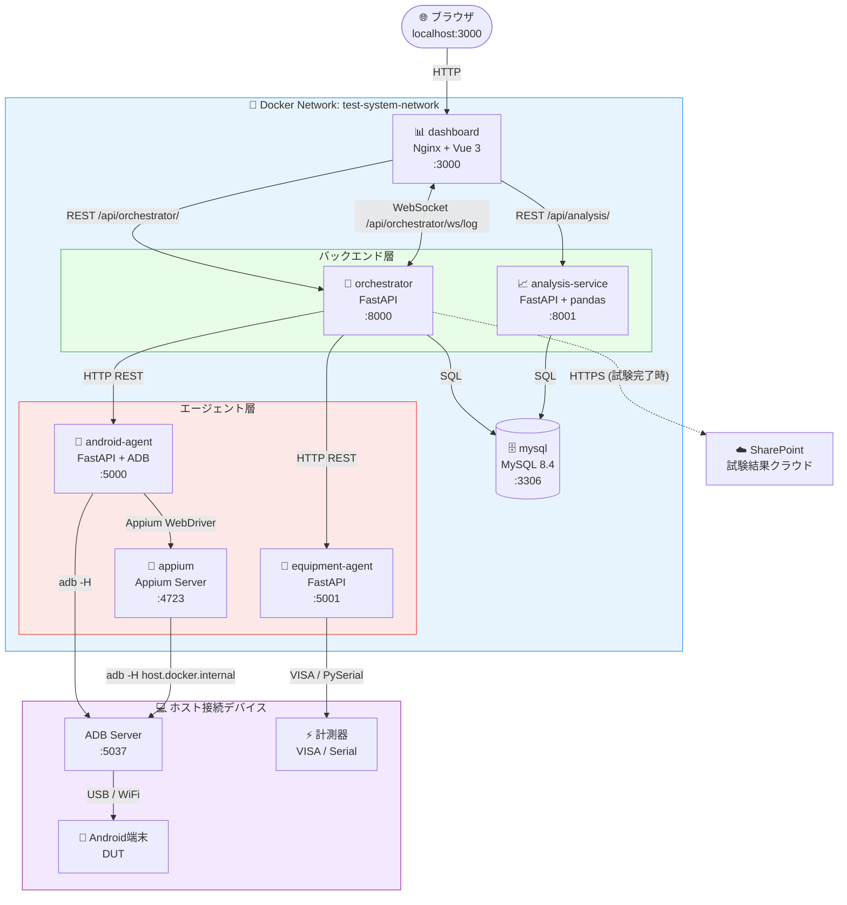

---

## 2. Dockerコンテナ構成図

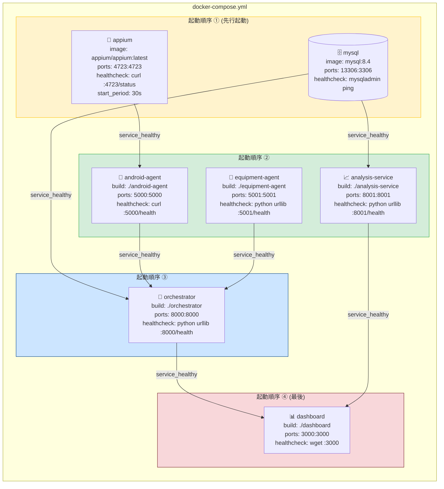

### 2.1 ボリューム・ネットワーク構成

```
volumes:
  mysql_data ─────────────── mysql:/var/lib/mysql          (永続データ)

bind mounts:
  ./orchestrator/scenarios ─ orchestrator:/app/scenarios   (YAMLシナリオ)
  ./results ──────────────── orchestrator:/app/results     (試験結果JSON)
  ./equipment-agent/config ─ equipment-agent:/app/config   (機器設定YAML)
  ./mysql/init ────────────── mysql:/docker-entrypoint-initdb.d (初期化SQL)

network:
  test-system-network (bridge) ─ 全コンテナ間通信
  host.docker.internal ─────── Dockerコンテナ→ホストPC (ADB接続用)
```

---

## 3. 起動シーケンス

### 3.1 `docker compose up -d` 実行時の起動フロー

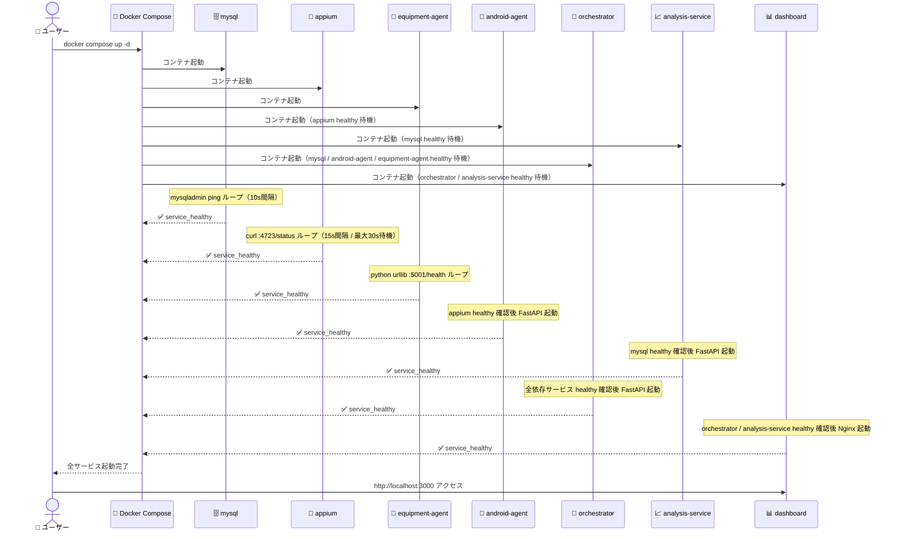

### 3.2 healthcheck 依存チェーン

```
[appium]────────────────────────────┐
                                    ▼
[mysql]──────┬──────────────► [android-agent]──┐
             │                                  ├──► [orchestrator]──► [dashboard]
             │               [equipment-agent]──┘
             │
             └──────────────► [analysis-service]──────────────────► [dashboard]
```

---

## 4. テスト実行シーケンス

### 4.1 試験開始から完了までの全体フロー

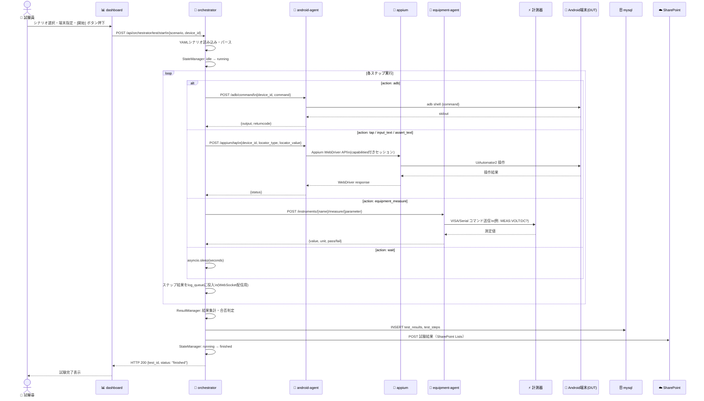

### 4.2 ステップ実行の詳細フロー（on_fail 制御）

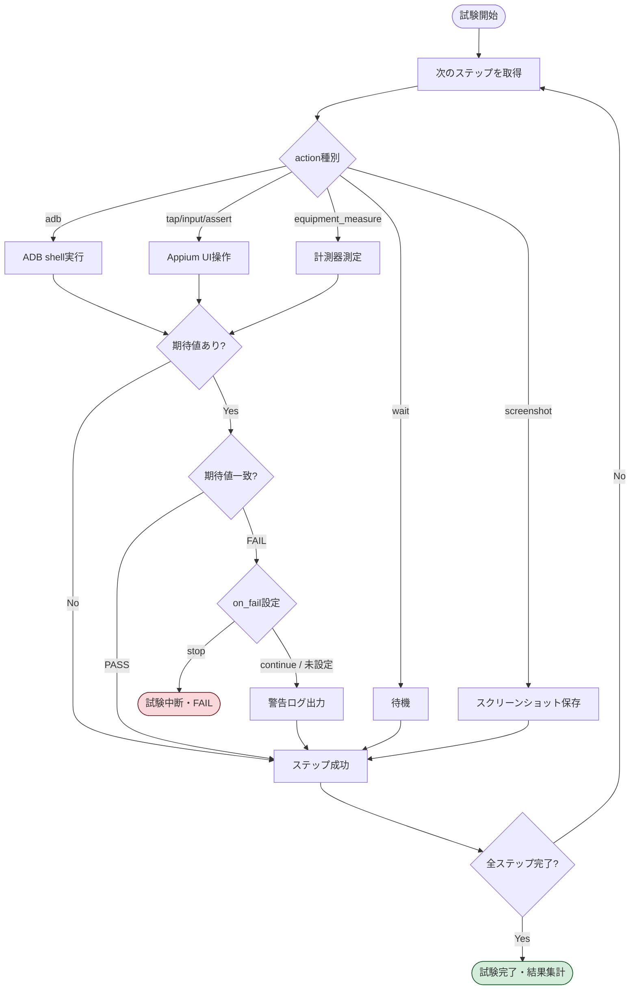

---

## 5. リアルタイムログ配信シーケンス

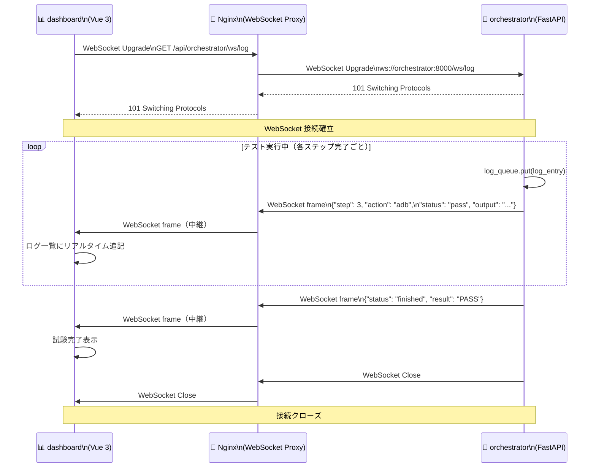

### 5.1 Nginx WebSocket プロキシ設定

```nginx
# dashboard/nginx.conf（抜粋）

location /api/orchestrator/ {
    proxy_pass         http://orchestrator:8000/;
    proxy_http_version 1.1;

    # WebSocket に必要なヘッダー
    proxy_set_header   Upgrade    $http_upgrade;
    proxy_set_header   Connection "upgrade";
    proxy_set_header   Host       $host;
}
```

---

## 6. 分析データ参照シーケンス

### 6.1 Android試験結果分析

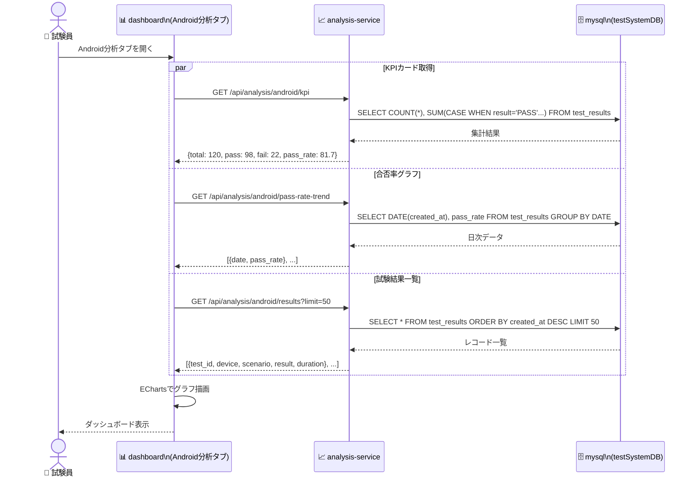

### 6.2 RF試験データ分析（汎用分析）

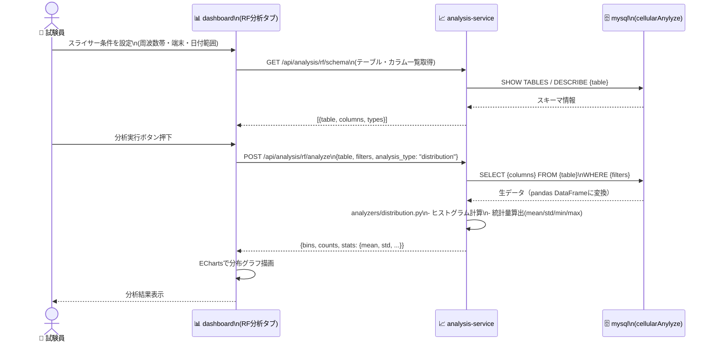

---

## 7. Equipment Agent プラグイン構造

### 7.1 プラグインアーキテクチャ

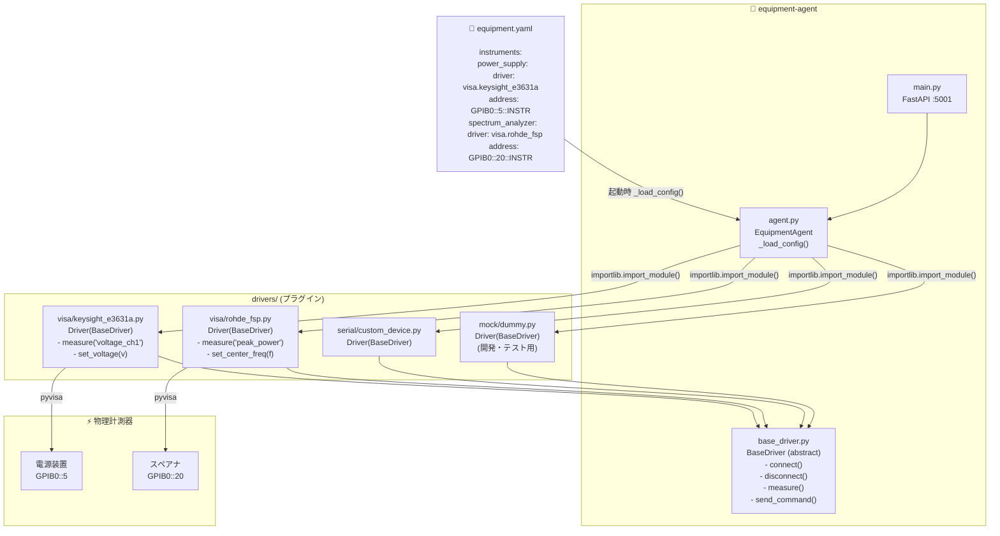

### 7.2 計測器追加手順

```
1. drivers/{type}/{instrument_name}.py を追加
   └── class Driver(BaseDriver) を実装

2. equipment.yaml に追記
   └── instruments:
         my_instrument:
           driver: visa.my_instrument
           address: "GPIB0::10::INSTR"

3. docker compose restart equipment-agent
   └── 再起動のみでOK（コードの変更不要）
```

---

## 8. データフロー概要

### 8.1 試験結果データの流れ

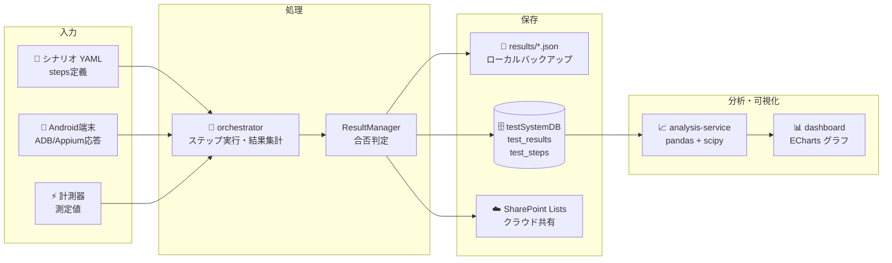

### 8.2 RFデータの流れ

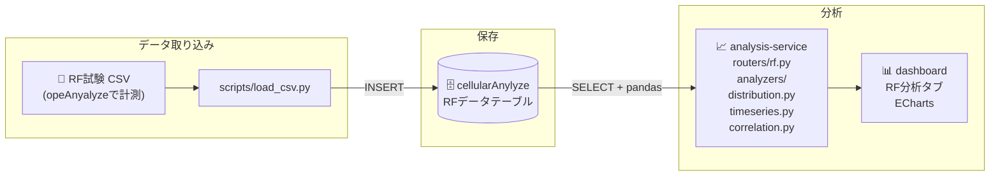

### 8.3 MySQLデータベース構成

```
mysql:3306
  ├── testSystemDB          ← Android試験結果
  │     ├── test_results    (試験ID・シナリオ・端末・合否・日時)
  │     └── test_steps      (ステップID・アクション・期待値・実測値・合否)
  │
  └── cellularAnylyze       ← RF試験データ (opeAnyalyze)
        └── {動的テーブル}   (スキーマはCSVインポート時に自動生成)
```

---

## 付録: ポート一覧

| サービス | コンテナポート | ホストポート | 用途 |
|---|---|---|---|
| dashboard | 3000 | 3000 | ブラウザアクセス |
| orchestrator | 8000 | 8000 | REST API / WebSocket |
| android-agent | 5000 | 5000 | ADB/Appium REST API |
| appium | 4723 | 4723 | Appium WebDriver Server |
| equipment-agent | 5001 | 5001 | 計測器制御 REST API |
| analysis-service | 8001 | 8001 | 分析 REST API |
| mysql | 3306 | **13306** | MySQL (ホスト3306は別用途のため) |
